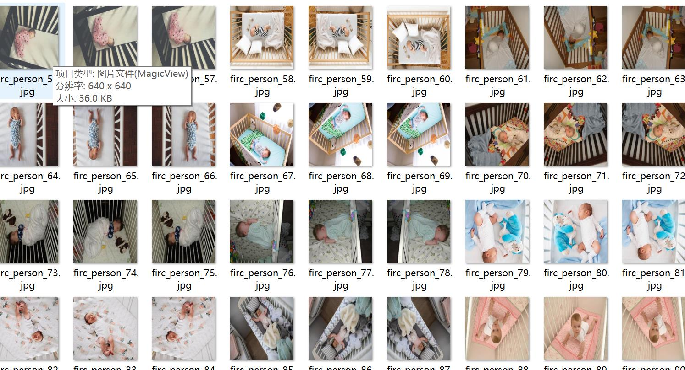
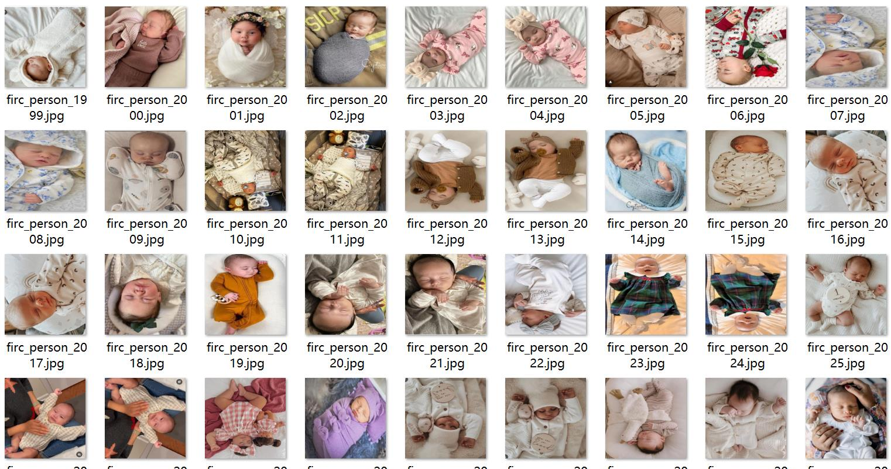
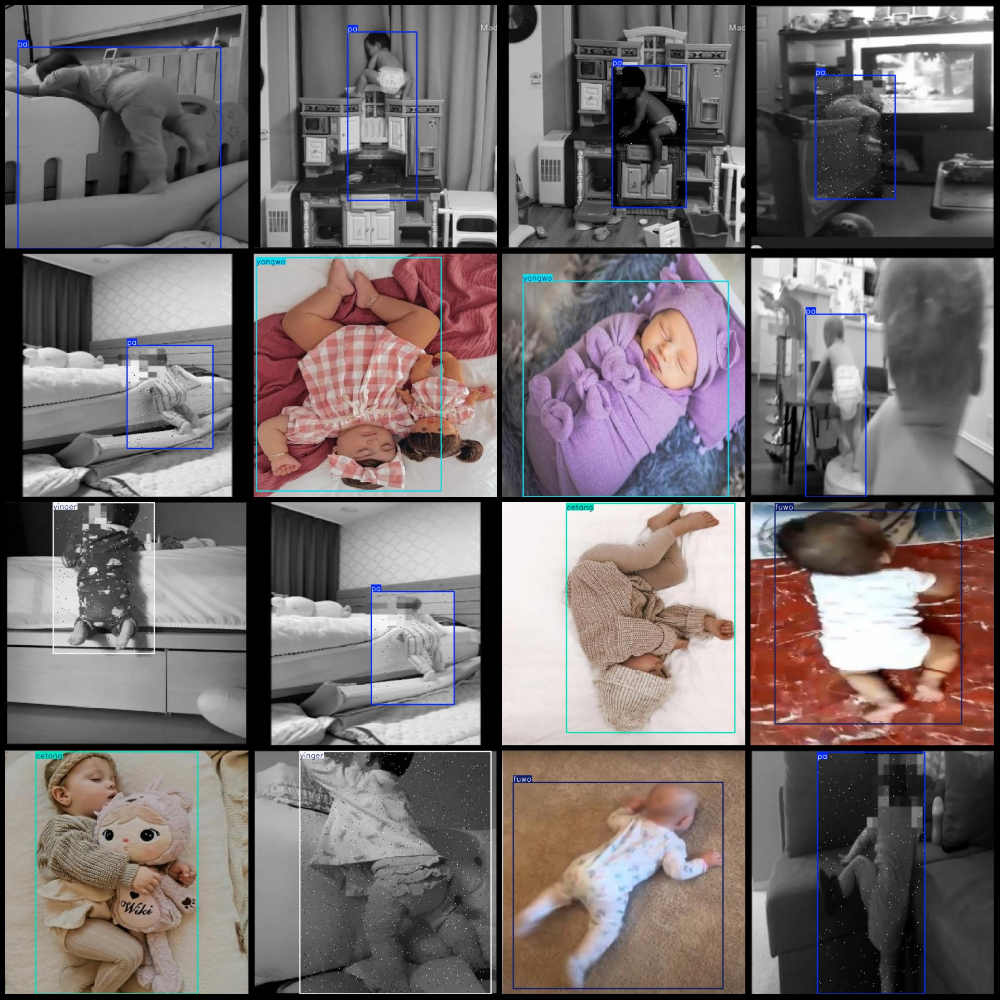
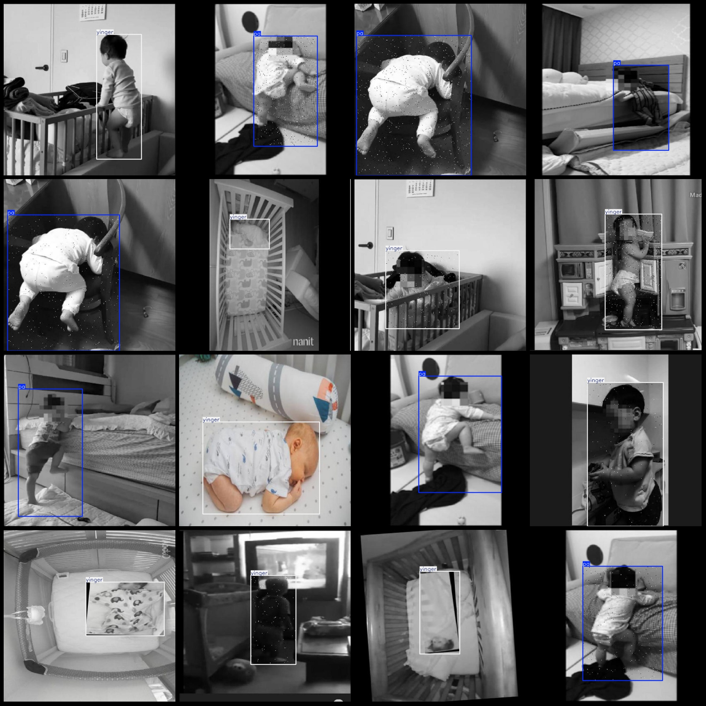

# Baby Monitoring, Infant Posture Recognition, and Infant Behavior State Detection Dataset (VOC+YOLO) - 3143 Images in 6 Classes

Please note that approximately 1000 images are originals, while the remaining are augmented. The main changes involve altering the contrast and adding salt-and-pepper noise to the target region.

The dataset format is Pascal VOC with a YOLO format (excluding the split path's txt file, only containing jpg images, along with their corresponding VOC XML files and YOLO txt files).

Number of images (jpg file count): 3143
Number of annotations (xml file count): 3143
Number of annotations (txt file count): 3143
Number of annotation classes: 6
Annotation class names according to the yolo format (notice that the order of classes in the yolo format does not correspond to this, but rather, it is based on the labels folder's classes.txt): 
["cetang", "fuwo", "pa", "tang", "yangwo", "yinger"]
Box counts for each class:
- Cetang (Side-lying) boxes = 302
- Fuwo (Prone) boxes = 308
- Pa (Kneel) boxes = 1031
- Tang (Lying) boxes = 32
- Yangwo (Supine) boxes = 271
- Yinger (Infant) boxes = 1274
Total box count: 3218
Number of images per category:
- Cetang (Side-lying) images = 302
- Fuwo (Prone) images = 308
- Pa (Kneel) images = 1028
- Tang (Lying) images = 32
- Yangwo (Supine) images = 269
- Yinger (Infant) images = 1241
Image resolution: 640x640
Annotation tool used: labelImg
Annotation rules: draw rectangles around categories
Important Note: The dataset does not have separate training/validation/test sets; you will need to manually divide them.
Special Disclaimer: This dataset does not guarantee any accuracy in the trained models or weight files.
Image Preview:

## Images

Here is a pay link on Stripe ( https://buy.stripe.com/3cs8yP7sY87d0vu9AB ). Please contact me lonlonago@foxmail.com after funding $89, and I will send you a complete data files , thank you!

